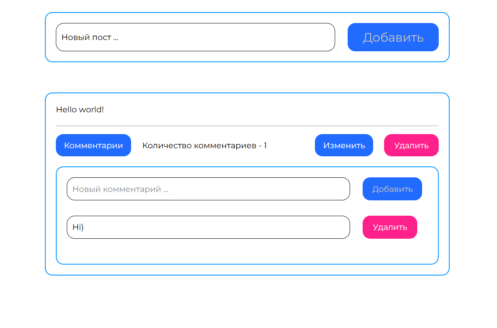

# Vue Pinia Social Book 
Веб-приложение для управления постами (CRUD)

## О проекте

**Vue Pinia Social Book** — это SPA-приложение для работы с постами, разработанное на 3 курсе колледжа в рамках дисциплины *JavaScript фреймворки*.

Проект создан на основе макета из Figma и реализует базовую функциональность социальной платформы: создание, редактирование и удаление постов. Основной акцент сделан на изучении экосистемы Vue 3, работе с состоянием через Pinia и построении компонентной архитектуры.

Figma макет:  
https://www.figma.com/design/p4jDYcwlRsEVihOixcleWQ/Social-Book?node-id=0-1&t=umNFf77hzrrunAJv-1

## Демо



---

## Задача проекта

- изучить фреймворк Vue 3  
- освоить управление состоянием с помощью Pinia  
- реализовать SPA-приложение  
- построить компонентную архитектуру  
- реализовать CRUD-операции для постов  
- организовать маршрутизацию  

---

## Функционал

- просмотр списка постов  
- добавление нового поста  
- редактирование поста (модальное окно)  
- удаление постов  
- централизованное хранение состояния (Pinia)  
- маршрутизация между страницами  
- адаптивный интерфейс  

---

## Технологии

- Vue 3  
- Pinia  
- TypeScript  
- Vite  


---

## Роль в проекте

**Выполненные задачи:**

- разработка SPA-приложения на Vue 3  
- реализация компонентной структуры  
- настройка и использование Pinia для хранения состояния  
- реализация CRUD-логики для постов  
- создание модальных окон для редактирования  
- настройка маршрутизации (Vue Router)  
- типизация данных с использованием TypeScript  

---

## Что решает проект

**Проект демонстрирует:**

- работу с современным стеком Vue  
- управление состоянием приложения  
- построение масштабируемой архитектуры  
- реализацию CRUD-операций  

---

## Практикуемые навыки

- Vue 3 (Composition API)  
- Pinia (state management)  
- TypeScript  
- компонентный подход  
- работа с модальными окнами  
- маршрутизация (Vue Router)  
- структура SPA-приложений  

---

## Структура проекта

```
vue-pinia/
├── public/
├── src/
│ ├── assets/
│ ├── components/
│ │ ├── AddButton.vue
│ │ ├── DeleteButton.vue
│ │ ├── EditButton.vue
│ │ └── EditPostModal.vue
│ ├── pages/
│ │ └── HomePage.vue
│ ├── router/
│ │ └── index.ts
│ ├── stores/
│ │ └── posts.ts
│ ├── types/
│ │ └── Post.ts
│ ├── App.vue
│ ├── main.ts
│ └── piniaStore.ts
│
├── index.html
├── package.json
├── vite.config.ts
└── README.md
```

---

## Запуск проекта

**1. Клонирование репозитория**
```
git clone https://github.com/Kirikiri2/vue-pinia.git
cd vue-pinia
```
**2. Установка зависимостей**
```
npm install
```
**3. Запуск проекта**
```
npm run dev
```
---

## Итог

**Проект успешно реализован в рамках учебной дисциплины и позволил:**

 - освоить Vue 3 и Pinia
 - понять принципы работы SPA
 - реализовать CRUD-логику
 - выстроить компонентную архитектуру
